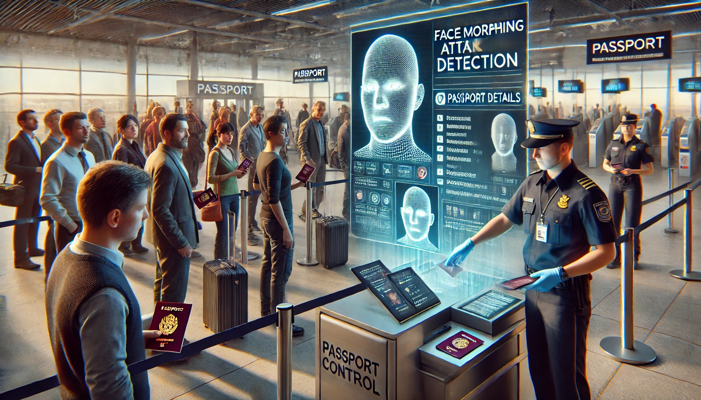

# Face Morph Attack Synthesis

The **Face Morph Attack Synthesis** project provides a comprehensive framework designed for synthesizing high-quality facial morphs. It aims to explore vulnerabilities in face recognition systems (FRSs), particularly under scenarios like automatic border control (ABC) gates, where the integrity of biometric verification is crucial. The project supports three primary morphing methods: **StyleGAN-Based Morphing**, **OpenCV-Based Morphing**, and **FaceMorpher-Based Morphing**. This toolkit is essential for researchers and developers working in biometrics, computer vision, and adversarial attack, aiming to enhance the security measures against face morphing attacks.


<p align="center">

<br>
Face Morphing Attack Detection at Passport Control 
</p>


---

## Features

- **StyleGAN-Based Morphing**:
  - Leverages state-of-the-art GANs for realistic facial morph generation with fine-grained control.
- **OpenCV-Based Morphing**:
  - In landmark-based morph generation, OpenCV is utilized to detect critical facial landmarks, ensuring precise alignment of faces before morphing.
- **FaceMorpher-Based Morphing**:
  - Simplifies face morphing through automated landmark detection, Delaunay triangulation, and pixel-wise blending for efficient and effective transformations.
- **Customizable Inversion Techniques for StyleGAN-Based Morphing**:
  - **Image2StyleGAN (I2S)** for detailed inversion using StyleGAN.
  - **Landmark-Based Inversion** for morphing based on facial landmarks. Focuses on integrating facial landmarks into the morphing process to ensure that the morphed images maintain a high degree of authenticity and can effectively challenge FRSs.
  - Offers options for adjusting and warping landmarks before inversion, refining the morph to closely match or blend the features of the subjects involved.
- **Flexible Output Directory Structure**:
  - Organizes results by morphing method, inversion type, warping status, and image pair.

---

## Project Structure

```plaintext
Face-Morph-Attack-Synthesis/
│
├── src/
│   ├── inversion/                         # Inversion methods for morphing
│   │   ├── image_inverter.py              # Image2StyleGAN inversion  +  Warping + I2S inversion
│   │   ├── landmark_inverter.py           # Landmark-based inversion +  Warping + Landmark-based inversion
│   │   ├── Image2StyleGAN.py              #  
│   │   ├── Image2StyleGAN_convex_hull.py  # 
│   ├── warping/                 # Warping utilities
│   │   ├── warper.py            # Core warping logic
│   ├── morphing/                # Morphing methods
│   │   ├── latent_morpher.py    # Performs latent morphing for given coefficients and saves the results
│   │   ├── opencv_morph.py      # Morphing using OpenCV 
│   │   ├── facemorpher.py       # Morphing using FaceMorpher
│   ├── utils/                   # Utilities
│   │   ├── file_utils.py        # File management utilities
│   │   ├── image_utils.py       # Image processing utilities
│   │   ├── align_image.py       # Image alignment utility
│   ├── main.py                  # Main entry point for the project
│
├── examples/                    # Example inputs and outputs
│   ├── input_images/            # Input images for morphing
│   ├── morph_pairs.txt          # Input pairs for morphing
│
├── requirements.txt             # Dependencies for the project
├── README.md                    # Project documentation
└── LICENSE                      # License for the project
```
 
---


## Getting Started

### Prerequisites
1. Install the required dependencies:
   ```bash
   pip install -r requirements.txt
   ```
2. Download the necessary model weights (for StyleGAN-Based Morphing):
   - **StyleGAN Models**:
     - [FFHQ at 1024x1024 (`ffhq.pkl`)](https://path-to-models/ffhq.pkl)
     - [FFHQ at 512x512 (`ffhq-512-avg-tpurun1.pkl`)](https://path-to-models/ffhq-512-avg-tpurun1.pkl)
     - [StyleGAN2 FFHQ (`stylegan2-ffhq-config-f.pkl`)](https://path-to-models/stylegan2-ffhq-config-f.pkl)
   - **Landmark Detection**:
     - [Shape Predictor 68 (`shape_predictor_68_face_landmarks.dat`)](https://path-to-models/shape_predictor_68_face_landmarks.dat)
   - **Perceptual Features**:
     - [VGG16 (`vgg16.pt`)](https://path-to-models/vgg16.pt)
     - [VGG Perceptual Loss (`vgg16_zhang_perceptual.pkl`)](https://path-to-models/vgg16_zhang_perceptual.pkl)
   Place them in a directory named `pretrained`.

---

## Command-Line Usage

### Morphing with StyleGAN-Based Inversion

#### Image2StyleGAN (I2S) Inversion without Warping
```bash
python main.py --method StyleGAN --inversion I2S --warping False --network ./pretrained/ffhq.pkl --num_steps 1000 --output_dir output
```

#### Landmark-Based Inversion with Warping
```bash
python main.py --method StyleGAN --inversion Landmark --warping True --network ./pretrained/ffhq.pkl --num_steps 1000 --output_dir output
```

---

## Output Structure

The results are stored in the following structure:

```plaintext
output/
├── StyleGAN_Warping_I2S_image1_image2/
│   ├── embeddings/
│   ├── warped/
│   ├── aligned/
│   ├── morphed/
│   ├── morphed_masks/
│
├── StyleGAN_NoWarping_Landmark_image1_image2/
│   ├── embeddings/
│   ├── morphed/
```

---

## Example Morph Generation Output

Below is an example of a morph generated using StyleGAN-Based Morphing:


---

## TODO

- [ ] **Integrate Evaluation**:
  - Add evaluation pipeline for morph quality and adversarial effectiveness in **Google Colab**.
- [ ] **Enhance OpenCV Morphing**:
  - Improve control over blending ratios and masks.
- [ ] **Extend FaceMorpher**:
  - Refine integration with facial landmarks for higher fidelity.

---

## License

This project is licensed under the terms specified in the LICENSE file. For specific terms regarding StyleGAN, please refer to NVIDIA's license.

---

## Acknowledgments

- StyleGAN and StyleGAN2 by NVIDIA.
- Facenet-PyTorch for face alignment and feature extraction.